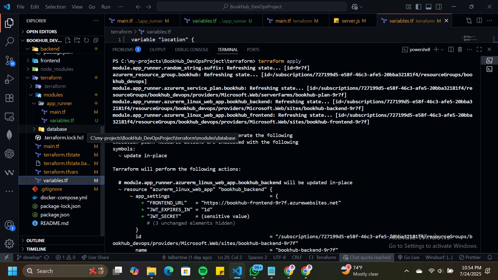
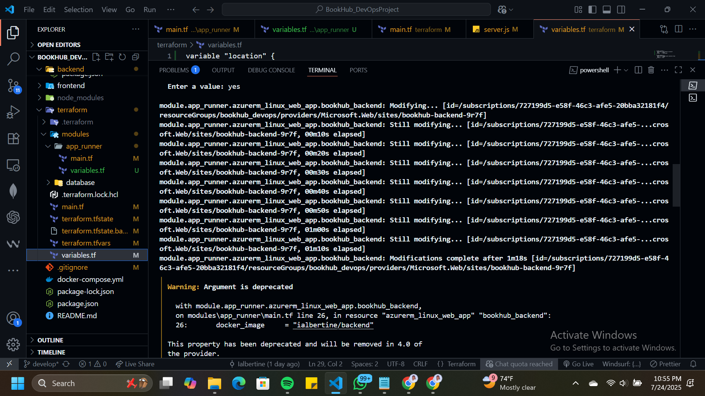
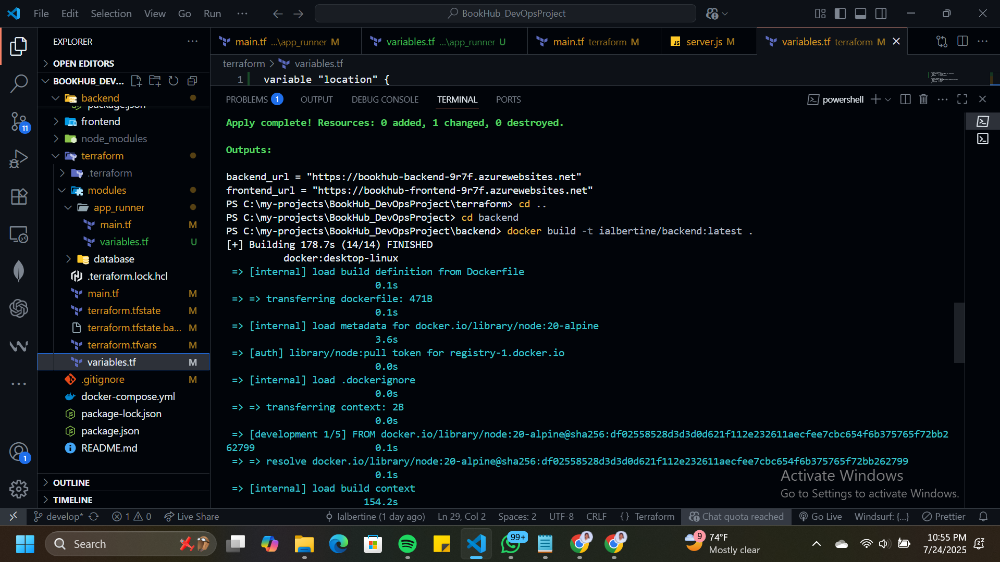
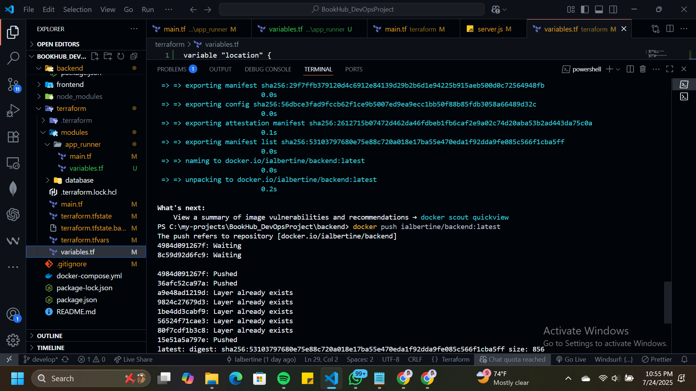

### Link to the AzureWebsites URL for Frontend and Backend

## Frontend URL: https://bookhub-frontend-9r7f.azurewebsites.net/ 

## Backend API URL: https://bookhub-backend-9r7f.azurewebsites.net/api/

### Screenshots of The successfully provisioned resources when deploying to Azure

