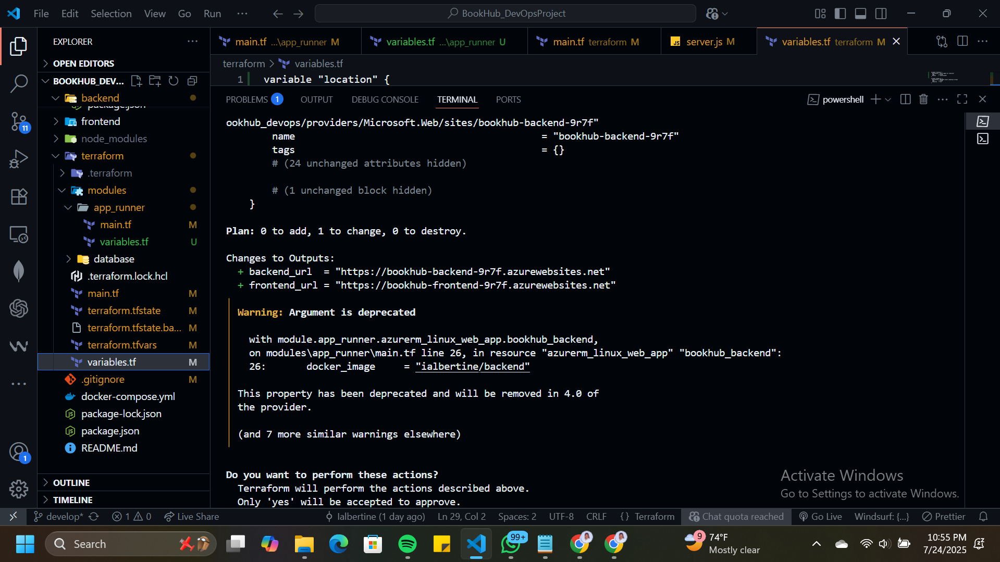

### Link to the AzureWebsites URL for Frontend and Backend

## Frontend URL: https://bookhub-frontend-9r7f.azurewebsites.net/ 

## Backend API URL: https://bookhub-backend-9r7f.azurewebsites.net/api/

### Screenshots of The successfully provisioned resources when deploying to Azure

## A brief reflection on the challenges of IaC and the manual deployment process.

Using Infrastructure as Code (IaC) definitely streamlines cloud deployments, but it also comes with its own set of Challenges. I used Terraform alongside the Azure CLI to provision and manage my infrastructure, and while the automation saved time in the long run, the initial learning curve was steep especially when dealing with state files and figuring out unclear error messages.

A big challenge I faced was working within the limits of the Azure for Students starter subscription. Some services, like Azure Container Registry and Cosmos DB, had restrictions or simply weren't available in the free tier or in certain regions. I also ran into regional availability issues that blocked deployment for specific resources. Because of these limitations, I had to pivot and use Docker Hub instead of Azure's container registry, and for my database, I set up a MongoDB cluster outside of Azure to get around Cosmos DB constraints.

Manual deployments might seem easier at first, but they become fragile and inconsistent as projects scale. IaC offers the consistency and repeatability teams need but only if you’re ready to invest the time upfront and learn how to handle the edge cases. The real challenge is striking a balance between automation and hands-on control, so your system remains both efficient and resilient.

## Links of the PRs of the DIVINE BIRASA I reviewd 

- https://github.com/IBIRASA/KnotNest/pull/10/files/b88ed6708d22efc2424d55e7efec7a5d59eba03d..bb0d57cf017ef2a204aaf0b01c9da1138ec48e2a  

- https://github.com/IBIRASA/KnotNest/commit/0b2999b41747b12b038295fe57e3efcd2e0e5d5e 
